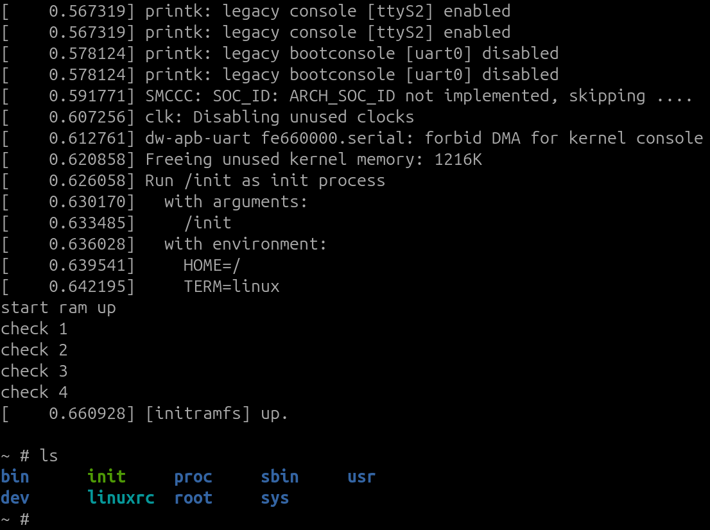
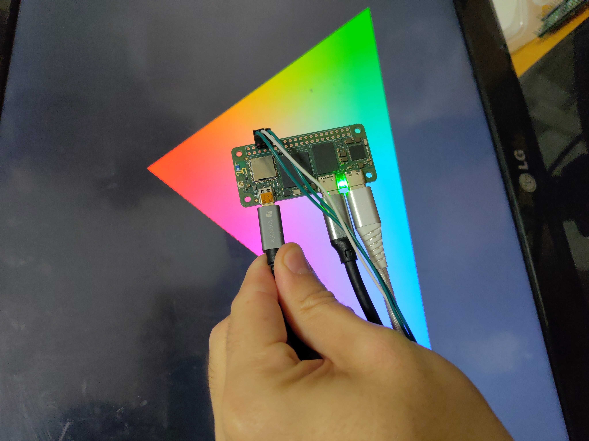
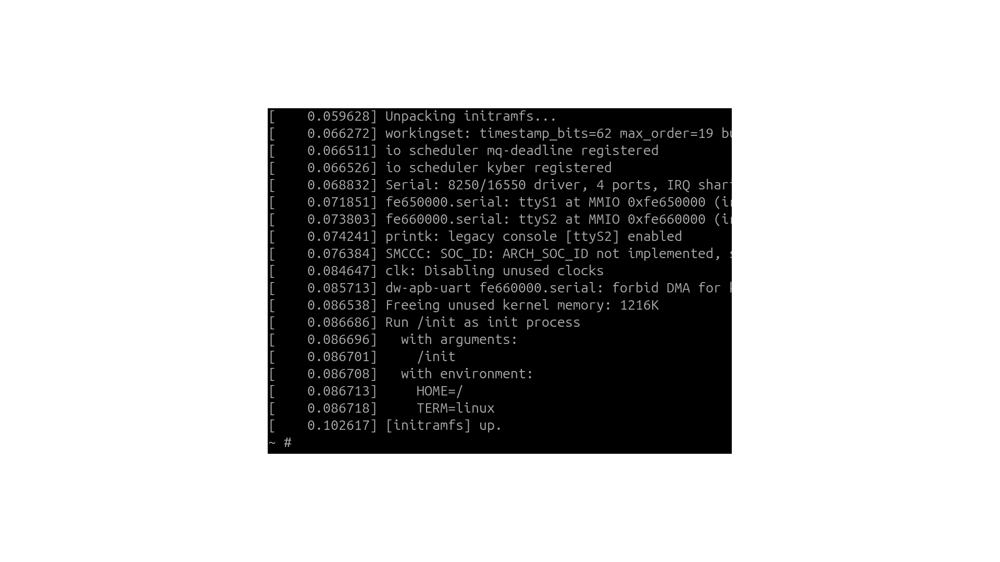

# WristLab Watch Platform (WIP)
MCU always-on + Linux wake-on-demand wearable architecture.

Current dev board: Radxa ZERO 3W  
Boot-to-shell: ~100ms (initramfs)  
GPU: Vulkan up (first triangle rendered)  
Display: HDMI (temporary)

## Status: early bring-up (actively building)
This repo is being structured + cleaned up for public release.
If you found this early: you're not crazy — it's real hardware work in progress.

🛠 Next: power-cycle + measurement harness + wake/sleep demo

Follow updates here:
TBA

## Roadmap

This project is in a very early bring-up phase (POC):
**MCU always-on + Linux wake-on-demand** for a wearable-class device.

### Phase 0 — Bring-up proof (DONE / in progress)
- [x] Boot Linux on Radxa ZERO 3W
- [x] Boot-to-shell ~100ms using initramfs
- [x] GPU bring-up (Vulkan first triangle), boots over Usb2Eth
- [x] U-Boot Falcon Mode

### Phase 1 — Measurement harness (NEXT)
Goal: make progress measurable and reproducible.
- [ ] Fuse Pico + Radxa
- [ ] Pico-controlled hard power switch (load switch / MOSFET)
- [ ] UART timestamp logging + boot markers
- [ ] Scope sync GPIO pulse (BOOT_START)
- [ ] Boot-time distribution (10–50 runs) + logs committed

### Phase 2 — “Watch off illusion” demo (NEXT)
Goal: instant usability with burst compute.
- [ ] MCU provides instant watch state
- [ ] Tap/button -> Linux wakes
- [ ] Linux boot + renders UI/Vulkan demo (still HDMI)
- [ ] Linux sleeps/shutdown again

### Phase 3 — Display path (replace HDMI with MIPI)
Goal: display bring-up, custom hardware design for display
- [ ] Replace HDMI with MIPI DSI (ideal) or SPI panel (simpler)
- [ ] Optimized GPU + display path
- [ ] First end-to-end UI render on real wearable display

### Phase 4 — Power optimization loop
Goal: make it not stupid on battery.
- [ ] Measure idle/sleep current with Linux fully off
- [ ] Tune wake latency vs power draw
- [ ] Define “daily wearable profile” targets (wake cost, standby time)

### Phase 5 — Hardware direction (later)
- [ ] Complete watch hardware design
- [ ] Battery + charger integration
- [ ] Enclosure / strap prototype

## WIP: Naive early demos

